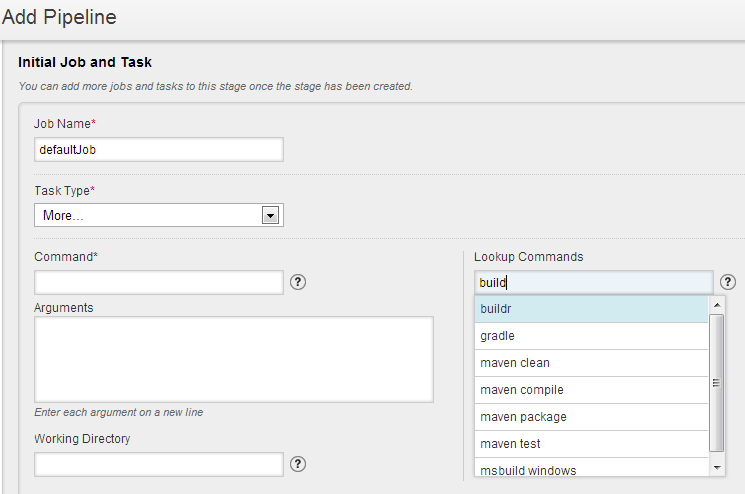
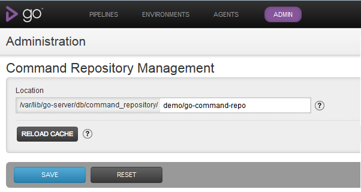

Help documentation
==================

 

Command Repository {.collapsible-heading onclick="toggleCollapse($(this));"}
==================

### Introduction {#introduction .collapsible-heading onclick="toggleCollapse($(this));"}

This feature is an enhancement to [Custom
Commands](http://support.thoughtworks.com/entries/22873043-go-s-custom-command)
in Go. Rather than start from scratch with command name and arguments,
you now have the option to look up a command from a repository of useful
commands maintained by the Go team. The lookup provides a starting
point, you may need to edit the arguments, specify a working directory
etc. Once saved, the behaviour is the same as a manually entered custom
command.

### Using the command repository {.collapsible-heading onclick="toggleCollapse($(this));"}

This feature can be used anywhere you need to specify a custom command.

-   Add a new pipeline

    

-   Add a new stage to a pipeline
-   Add a new job to a stage
-   Add a new task to a job
-   Edit a task

**Custom commands and agents**

Go does not check if the command that you have specified is available on
the agents.

Install the relevant command on all the agents where you want it to run.
If it is not available on the default path, add it to the path in
/etc/default/go-agent or equivalent. This requires an agent restart.

Alternatively, create a symbolic link to the path to the executable from
/bin or equivalent folder. This doesn't require an agent restart

#### Args style commands {#args .collapsible-heading onclick="toggleCollapse($(this));"}

The older [args](configuration_reference.html#exec) style commands are
not supported by this feature. Please convert them to the new syntax
using the config xml editor ( **Admin \> Config XML** ). For example:

``` {.code}
<exec command="touch" args="a b c"/>
```

becomes

``` {.code}
<exec command="touch">
  <arg>a</arg>
  <arg>b</arg>
  <arg>c</arg>
</exec>
```

### Bundled Repository {#bundled-repo .collapsible-heading onclick="toggleCollapse($(this));"}

The default set of commands come from
[https://github.com/goteam/go-command-repo](%20https://github.com/goteam/go-command-repo).
This repository is maintained by the Go team. The Go server installer
bundles a clone of this Git repository under
**\<server-install-root\>/db/command\_repository/default** . Future Go
server upgrades will overwrite the contents of this directory with an up
to date set of commands. Hence, please do not add your commands here.
Instead, set up a [private
repository](command_repository.html#pvt-repo).

#### Pulling Updates {#pull-updates .collapsible-heading onclick="toggleCollapse($(this));"}

Go team will continue to add (and sometimes update) commands to the
repository on GitHub. If you want to make these commands available to
your Go server without waiting for a new release or without upgrading
your Go server, you could git pull them into
\<go-server-install-root\>/db/command\_repository/default as desired.

**Linux/Unix**

Here is a simple crontab entry that you could add to Go service
account's crontab to pull commands once a day.

``` {.code}
@daily cd <go-server-install-root>/db/command_repository/default;git pull >>/var/go/cronrun 2>&1
```

Caution: Don't pull as root/administrator. Use the Go service account.

**Windows**

On Windows, you could set up a scheduled task to run this script on a
schedule.

``` {.code}
echo %date% %time% >>c:\pull-log.txt 2>&1
cd "C:\Program Files (x86)\Go Server\db\command_repository\default"
git pull >>c:\pull-log.txt 2>&1
```

Go caches these commands with a refresh interval of 30 minutes so you
may not see the results of a pull immediately in the lookup unless you
hit the reload cache button under the command repository section on the
server configuration admin page or by using the [reload
API](command_repo_api.html).

### Private Repository {#pvt-repo .collapsible-heading onclick="toggleCollapse($(this));"}

If you want to add your own commands for look up, you should set up your
own Git/Mercurial/Subversion/Perforce/TFS repository that your command
authors can commit/check-in into.

Make a clone/working copy available under
**\<go-server-install-root\>/db/command\_repository/\<your-repo-name\>**
. Symbolic links are not supported.

Switch Go Server to this location

To do this, go to **Command Repository Management** section of **Server
Configuration** in **Admin** tab and change the **default** value



From the Go server's point of view, the command repository is just a
directory under which it recursively looks for valid command.xml files.
Note that directory names starting with a dot will be ignored.

Go will not lookup from the bundled repository if you switch to your own
repository. You could choose to manually seed your private command
repository with Go's bundled set of commands if you want to have them in
addition to your own commands.

#### Recommended process {#pvt-repo-process .collapsible-heading onclick="toggleCollapse($(this));"}

Command author pushes/checks-in command to corporate version control
system

Cron job on Go-server pulls/updates local repository/working copy in due
course

Go Server caches the commands to improve response time. In case of
changes in the command repository, new command gets into the cache in
one of the following ways:

1.  The default cache invalidation interval of 30 mins kicks in and the
    cache gets refreshed
2.  Go server admin clicks on the **RELOAD CACHE** button
3.  Go server admin uses the [**reload API**](command_repo_api.html)
    through a cron job or otherwise to force a cache reload.

The commands in the command repository are not part of your Go Server
config. They become part of your Go server config only after you
(optionally edit and) save them.

### Command syntax and lookup logic {#lookup-logic .collapsible-heading onclick="toggleCollapse($(this));"}


The above screenshot resulted from the command below:

``` {.code}
<!--
name: curl
description: Download from a protected Url and saveToFile
author: Go Team
authorinfo: http://support.thoughtworks.com/categories/20002778-go-community-support
keywords: curl, http, download, wget
moreinfo: http://curl.haxx.se/docs/manual.html
-->
<exec command="curl">
  <arg>-o</arg>
  <arg>saveToFile</arg>
  <arg>-u</arg>
  <arg>user:password</arg>
  <arg>http://targeturl</arg>
</exec>
```

This is an example of valid command syntax. The command attribute is
mandatory. No other attributes are valid. Zero or more arg child
elements can be specified. No other child elements are allowed. One
command file may only contain one command.

**Please refer the
[README](https://github.com/goteam/go-command-repo/blob/master/README.md)
for full command and documentation syntax.**

When you lookup a command, the following logic is used to sort the
resulting suggestions:

1.  Exact matches of name in command documentation (or filename if name
    missing)
2.  Partial starts-with matches of name in command documentation (or
    filename if name missing)
3.  Exact matches of keywords in command documentation

Within each category, the sorting is alphabetical.

### Contributing Commands {#contrib-cmds .collapsible-heading onclick="toggleCollapse($(this));"}

We welcome commands contributed by users. Simply,

1.  [fork](https://help.github.com/articles/fork-a-repo) this [GitHub
    repo](https://github.com/goteam/go-command-repo)
2.  Clone it locally
3.  Commit and push your change
4.  Send us a [pull
    request](https://help.github.com/articles/using-pull-requests)

Accepted commands will be bundled into the next release.

### Further Reading {#further .collapsible-heading onclick="toggleCollapse($(this));"}

[Use it to lookup your config
scripts](http://www.thoughtworks.com/insights/blog/use-gos-new-command-repository-lookup-your-config-scripts)

Your search did not match any help pages.

-   [Welcome to Go](welcome_to_go.html)
    -   [What's new in Go](whats_new_in_go.html)
    -   [Concepts in Go](concepts_in_go.html)
-   Installing Go
    -   [System requirements](system_requirements.html)
    -   [Installing Go server](installing_go_server.html)
    -   [Installing Go agent](installing_go_agent.html)
    -   [Running Go without installation](run_go_without_install.html)
    -   [Upgrading Go](upgrading_go.html)
    -   [Configuring server details](configuring_server_details.html)
    -   [Configure a Proxy](configure_proxy.html)
    -   [Performance Tuning](performance_tuning.html)
-   Using Go
    -   [Setup a new pipeline](quick_pipeline_setup.html)
    -   [Managing pipelines](managing_pipelines.html)
    -   [Managing agents](managing_a_build_cloud.html)
    -   [Managing artifacts and
        reports](managing_artifacts_and_reports.html)
    -   [Managing dependencies](managing_dependencies.html)
    -   [Managing environments](managing_environments.html)
    -   [Setting up authentication](dev_authentication.html)
    -   [Managing Users](managing_users.html)
    -   [Notifications](dev_notifications.html)
    -   [Properties](properties.html)
    -   [Pipeline Labelling](build_labelling.html)
    -   [Compare Builds](compare_pipelines.html)
    -   [Integration with external tools](go_integration.html)
    -   [Ordering of pipelines](ordering_of_pipelines.html)
    -   [Pipeline Scheduling](pipeline_scheduling.html)
    -   [Gadgets](gadgets.html)
    -   [Auto delete artifacts](delete_artifacts.html)
    -   [Job Timeout](job_timeout.html)
    -   [Graphs](stage_duration_chart.html)
    -   [Historical Configuration](stage_old_config.html)
    -   [Command Repository](command_repository.html)
    -   [Concurrent Modifications to Go's
        Configuration](concurrent_config_modifications.html)
    -   [Package Material](package_material.html)
    -   [Plugin User Guide](plugin_user_guide.html)
-   Go Tour
    -   [Pipelines Dashboard](Pipelines_Dashboard_page.html)
    -   [Agents](agents_page.html)
    -   [Pipeline Activity](pipeline_activity_page.html)
    -   [Stage Details](stage_details_page.html)
    -   [Job Details](job_details_page.html)
    -   [Administration](administration_page.html)
    -   [Server Details](server_details_page.html)
    -   [Environments](environments_page.html)
    -   [Value Stream Map](value_stream_map.html)
-   As a Developer, I want to...
    -   [...watch what's currently
        building](Pipelines_Dashboard_page.html)
    -   [...trigger a pipeline with a different revision of
        material](trigger_with_options.html)
    -   [...be notified when I break the build](dev_notifications.html)
    -   [...understand why the build is
        broken](dev_understand_why_build_broken.html)
    -   [...see my artifacts as a sub-tab on the Job Details
        page](dev_see_artifact_as_tab.html)
    -   [...save properties about a build](dev_save_properties.html)
    -   [...clean up my environment when I cancel a
        task](dev_clean_up_when_cancel.html)
    -   [...only run a task when the build has
        failed](dev_conditional_task_execution.html)
    -   [...use the current revision in my
        build](dev_use_current_revision_in_build.html#current)
-   As a Tester, I want to...
    -   [...release something into my UAT
        environment](rm_deploy_to_environment.html#deploy_uat)
    -   [...know what has changed in my new
        binary](tester_what_has_changed.html)
    -   [...ensure appropriate tests are run against new
        builds](dependency_management.html)
-   As a Release Manager, I want to...
    -   [...release something into
        production](rm_deploy_to_environment.html#deploy_prod)
    -   [...know what's currently in
        production](rm_what_is_deployed.html)
    -   [...deploy a specific build to
        production](deploy_a_specific_build_to_an_environment.html)
    -   [...manage my environments](managing_environments.html)
-   As a Go Administrator, I want to...
    -   [...template my pipelines](pipeline_templates.html)
    -   [...parameterize my
        pipelines](admin_use_parameters_in_configuration.html)
    -   [...install a new agent](installing_go_agent.html)
    -   [...auto register a remote agent](agent_auto_register.html)
    -   [...clone/copy existing agents](agent_guid_issue.html)
    -   [...install multiple agents on one
        machine](admin_install_multiple_agents.html)
    -   [...view and filter agents](agents_page.html#filter_agents)
    -   [...add a new pipeline](quick_pipeline_setup.html)
    -   [...add a new material to an existing
        pipeline](admin_add_material.html)
    -   [...add a new stage to an existing
        pipeline](admin_add_stage.html)
    -   [...add a new job to an existing stage](admin_add_job.html)
    -   [...run the same job on a group of
        agents](admin_run_on_all_agents.html)
    -   [...pass environment variables to
        jobs](dev_use_current_revision_in_build.html#job)
    -   [...ensure only one instance of a pipeline can run at the same
        time](admin_lock_pipelines.html)
    -   [...choose when a certain stage
        runs](dev_choose_when_stage_runs.html)
    -   [...use a custom pipeline
        label](admin_use_custom_pipeline_label.html)
    -   [...manage my dependent pipelines](managing_dependencies.html)
    -   [...enable authentication on my Go
        server](dev_authentication.html)
    -   [..configure LDAP access for my Go
        server](dev_authentication.html#ldap_authentication)
    -   [...change permissions for different
        actions](dev_authorization.html)
    -   [...ensure only certain users can see a group of
        pipelines](dev_authorization.html#pipeline-groups)
    -   [...publish reports and artifacts](dev_upload_test_report.html)
    -   [...configure an agent to run UI tests](ui_testing.html)
    -   [...add mailhost information to support email
        notifications](admin_mailhost_info.html)
    -   [...clean up old artifacts when running out of disk
        space](admin_out_of_disk_space.html)
    -   [...run a pipeline on a schedule](admin_timer.html)
    -   [...pause an agent](managing_a_build_cloud.html#pausing_agent)
    -   [...see if a job fails because of an environment
        issue](agent_details.html#identifying_environment_issues)
    -   [...delegating group
        administration](delegating_group_administration.html)
    -   [...backup Go server](one_click_backup.html)
    -   [...be notified when Go server is not able to poll for
        changes](material_update_hung.html)
-   Mingle Integration
    -   [Displaying Mingle gadgets in Go](mingle_in_go.html)
    -   [Mingle Card Activity Gadget](mingle_card_activity_gadget.html)
-   [FAQ/Troubleshooting](http://support.thoughtworks.com/categories/20002778-go-community-support)
-   [Go API](go_api.html)
    -   [Artifacts API](Artifacts_API.html)
    -   [Properties API](Properties_API.html)
    -   [Configuration API](Configuration_API.html)
    -   [Pipeline API](Pipeline_API.html)
    -   [Stages API](Stages_API.html)
    -   [Command Repo API](command_repo_api.html)
    -   [Agent API](Agent_API.html)
    -   [Feeds API](Feeds_API.html)
    -   [Backup API](Backup_API.html)
    -   [Materials API](materials_api.html)
    -   [Users API](users_api.html)
-   Extension Points of Go
    -   [Plugins in Go](go_plugins_basics.html)
    -   [Go Plugin API](resources/javadoc/index.html)
    -   [Writing a package material
        plugin](writing_go_package_material_plugin.html)
    -   [Writing a task plugin](writing_go_task_plugins.html)
-   Bundled Plugins
    -   [Yum Repository Poller](yum_repository_poller.html)
-   Configuration
    -   [Configuration Reference](configuration_reference.html)
    -   [Schema](schema.html)

© ThoughtWorks Studios, 2010

