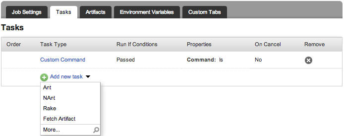
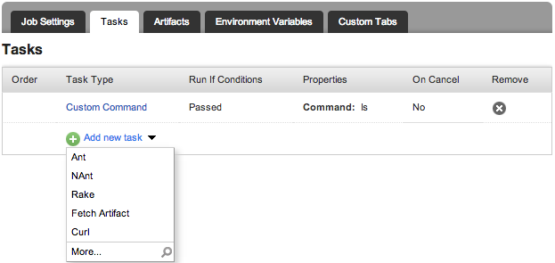
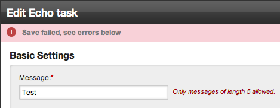

Help documentation
==================

 

Writing a task plugin {.collapsible-heading onclick="toggleCollapse($(this));"}
=====================

### Overview {.collapsible-heading onclick="toggleCollapse($(this));"}

Go supports configuring a few kinds of tasks (Nant, Ant and Rake),
directly, from the configuration UI, without specifying them as a custom
command. For instance, if you go to the configuration UI for a job,
you'll see something like this:



A task plugin allows you to extend this so that you can have other tasks
available here. The plugin also allows you to control the UI, as well as
the data stored for this task.

For instance, you can find the source of a sample Curl plugin, [at this
location](go_plugins_basics.html#building_a_plugin). Assuming you have
the plugin installed, you'll see that the dropdown in the job
configuration UI has changed to look like this:



When selected, the dialog box which allows you to configure details
about the task looks like this:


In the configuration XML, the information entered for this task looks
like this:

``` {.code}
<task>
  <pluginConfiguration id="curl.task.plugin" version="1" />
  <configuration>
    <property>
      <key>Url</key>
      <value>http://www.google.com</value>
    </property>
    <property>
      <key>SecureConnection</key>
      <value>no</value>
    </property>
    <property>
      <key>RequestType</key>
      <value>-G</value>
    </property>
    <property>
      <key>AdditionalOptions</key>
      <value />
    </property>
  </configuration>
  <runif status="passed" />
</task>
```

When a build which uses the plugin runs, the output of the build looks
something like this:

``` {.code}
[go] Start to execute task: Plugin with ID: curl.task.plugin.
Launching command: [curl, -G, --insecure, -o, pipelines/up42/index.txt, http://www.google.com]
Environment variables:
Name= MAVEN_OPTS  Value= -Xms256m -Xmx512m
Name= GO_STAGE_COUNTER  Value= 1
Name= GO_REVISION_BLAH  Value= cde1e03a05170b991a92a136278c3464e4f35fe7
Name= GO_JOB_NAME  Value= up42_job
Name= EDITOR  Value= vim
Name= SECURITYSESSIONID  Value= 186a4
... lots more environment variables ...
% Total    % Received % Xferd  Average Speed   Time    Time     Time  Current
Dload  Upload   Total   Spent    Left  Speed

0     0    0     0    0     0      0      0 --:--:-- --:--:-- --:--:--     0
0     0    0     0    0     0      0      0 --:--:--  0:00:02 --:--:--     0
100   259  100   259    0     0    122      0  0:00:02  0:00:02 --:--:--   122
```

The objective of this guide is to explain how to write such a task
plugin, for Go.

### Interface {.collapsible-heading onclick="toggleCollapse($(this));"}

Creating a task plugin involves implementing a few interfaces, which are
described below. If you need to know the basics of writing a plugin in
Go, read [this](go_plugins_basics.html). The concepts and processes
mentioned there apply to the task plugin end-point as well. On that
page, you can also find the go-plugin-api.jar file which contains the
interfaces mentioned below.

#### Task {.collapsible-heading onclick="toggleCollapse($(this));"}

The Task interface is the starting point of the task plugin end-point.
It is the top-level interface that needs to be implemented. However, to
implement the methods in it, you will need to be aware of a few other
interfaces and classes.


#### TaskConfig {.collapsible-heading onclick="toggleCollapse($(this));"}

TaskConfig is a class, which is used by the plugin to define the set of
configuration properties accepted and expected by it.


As shown above, it has an addProperty method, which is usually used to
add information about a configuration property. You can also provide a
default value for a property. It will be used if the user does not
provide any value for it. It can be setup this way (inside the config()
method of your plugin's task implementation):

``` {.code}
config.addProperty("MyProperty).withDefault("DEFAULT VALUE");
```

#### TaskView {.collapsible-heading onclick="toggleCollapse($(this));"}

The TaskView implementation provided by the plugin defines the UI part
of the configuration. The template() method returns a string, which is
written in HTML with Angular.js-specific elements. Every configuration
property specified by the TaskConfig mentioned earlier, will be
available as a variable, which can be used in the template.


You can read more about Go's use of Angular.js templates
[here](angular-js-templates-in-go-plugins.html).

#### TaskExecutor {.collapsible-heading onclick="toggleCollapse($(this));"}

The TaskExecutor implementation provided by the plugin (and its
execute() method, actually) is the one that gets called, on an agent,
when the plugin task needs to be executed.


The execute() method gets called with two arguments:

-   TaskConfig: This TaskConfig object is related to the one specified
    in the config() method in the Task Interface, but differs in that it
    contains the value of the property, specified by the user, as well.
-   TaskExecutionContext: This object contains contextual information
    related to this run of the task. It is explained in a bit more
    detail below.

#### TaskExecutionContext {.collapsible-heading onclick="toggleCollapse($(this));"}

The TaskExecutionContext is provided by Go, when the execute() method of
TaskExecutor is called on the agent, when a task needs to be run.


### Writing a simple task plugin {.collapsible-heading onclick="toggleCollapse($(this));"}

You can find the source of the sample Curl plugin mentioned earlier, [at
this location](go_plugins_basics.html#building_a_plugin).

Let's see what it takes to implement a simple task plugin, one which
takes a message from the user, and when executed, echoes that message
back. We need to start with a Task interface implementation, with the
config() method specifying the "message" field and the view() method
specifying a UI for it. Do not forget to annotate the class with
@Extension annotation, as specified in the [Go plugin basics
page](go_plugins_basics.html).

#### Version 1 - No validation {.collapsible-heading onclick="toggleCollapse($(this));"}

For version 1 of this plugin, we will ignore the validate() method. The
code looks like this:

``` {.code}
import com.thoughtworks.go.plugin.api.annotation.Extension;
import com.thoughtworks.go.plugin.api.response.execution.ExecutionResult;
import com.thoughtworks.go.plugin.api.response.validation.ValidationResult;
import com.thoughtworks.go.plugin.api.task.*;

@Extension
public class EchoTask implements Task {
  private static final String MESSAGE_KEY = "message";

  @Override
  public TaskConfig config() {
    TaskConfig config = new TaskConfig();
    config.addProperty(MESSAGE_KEY).withDefault("NO MESSAGE");
    return config;
  }

  @Override
  public TaskView view() {
    return new TaskView() {
      @Override
      public String displayValue() {
        return "Echo";
      }

      @Override
      public String template() {
        return "<div class=\"form_item_block\">\n" +
                "  <label>Message:<span class=\"asterisk\">*</span>\n" +
                "      <input type=\"text\" ng-model=\"" + MESSAGE_KEY + "\" ng-required=\"true\">\n" +
                "  </label>\n" +
                "</div>\n";
      }
    };
  }

  @Override
  public ValidationResult validate(TaskConfig configuration) {
    return new ValidationResult(); // No errors added to it.
  }

  @Override
  public TaskExecutor executor() {
    return new TaskExecutor() {
        @Override
        public ExecutionResult execute(TaskConfig config, TaskExecutionContext context) {
          context.console().printLine("Message is: " + config.getValue(MESSAGE_KEY));
          return ExecutionResult.success("Finished running echo plugin!");
        }
    };
  }
}
```

Now, the dropdown and configuration UI look like this:


The output of the task, when it runs, looks like this:

``` {.code}
[go] Start to execute task: Plugin with ID: echo.task.plugin.
Message is: Test
```

#### Version 2 - With validation {.collapsible-heading onclick="toggleCollapse($(this));"}

Let's add a validation to the save, so that only messages with length 5
are allowed. To do this, we need to add a validation error when a
message which is not of length 5 is entered. Also, we need to change the
template so that it can show an error. The code looks like this:

``` {.code}
import com.thoughtworks.go.plugin.api.annotation.Extension;
import com.thoughtworks.go.plugin.api.response.execution.ExecutionResult;
import com.thoughtworks.go.plugin.api.response.validation.ValidationError;
import com.thoughtworks.go.plugin.api.response.validation.ValidationResult;
import com.thoughtworks.go.plugin.api.task.*;

@Extension
public class EchoTask implements Task {
  private static final String MESSAGE_KEY = "message";

  @Override
  public TaskConfig config() {
    TaskConfig config = new TaskConfig();
    config.addProperty(MESSAGE_KEY).withDefault("NO MESSAGE");
    return config;
  }

  @Override
  public TaskView view() {
    return new TaskView() {
      @Override
      public String displayValue() {
        return "Echo";
      }

      @Override
      public String template() {
        return "<div class='form_item_block'>\n" +
            "  <label>Message:<span class='asterisk'>*</span></label>\n" +
            "    <input type='text' ng-model='" + MESSAGE_KEY + "' />\n" +
            "    <span class=\"form_error\" ng-show=\"GOINPUTNAME[" + MESSAGE_KEY + "].$error.server\">{{ GOINPUTNAME[" + MESSAGE_KEY + "].$error.server }}</span>\n" +
            "</div>\n";
      }
    };
  }

  @Override
  public ValidationResult validate(TaskConfig configuration) {
    ValidationResult result = new ValidationResult();

    String message = configuration.getValue(MESSAGE_KEY);
    if (message == null || message.length() != 5) {
      result.addError(new ValidationError(MESSAGE_KEY, "Only messages of length 5 allowed."));
    }

    return result;
  }

  @Override
  public TaskExecutor executor() {
    return new TaskExecutor() {
      @Override
      public ExecutionResult execute(TaskConfig config, TaskExecutionContext context) {
        context.console().printLine("Message is: " + config.getValue(MESSAGE_KEY));
        return ExecutionResult.success("Finished running echo plugin!");
      }
    };
  }
}
```

Now, the configuration UI looks like this, when trying to save a message
which is not of length 5:



Your search did not match any help pages.

-   [Welcome to Go](welcome_to_go.html)
    -   [What's new in Go](whats_new_in_go.html)
    -   [Concepts in Go](concepts_in_go.html)
-   Installing Go
    -   [System requirements](system_requirements.html)
    -   [Installing Go server](installing_go_server.html)
    -   [Installing Go agent](installing_go_agent.html)
    -   [Running Go without installation](run_go_without_install.html)
    -   [Upgrading Go](upgrading_go.html)
    -   [Configuring server details](configuring_server_details.html)
    -   [Configure a Proxy](configure_proxy.html)
    -   [Performance Tuning](performance_tuning.html)
-   Using Go
    -   [Setup a new pipeline](quick_pipeline_setup.html)
    -   [Managing pipelines](managing_pipelines.html)
    -   [Managing agents](managing_a_build_cloud.html)
    -   [Managing artifacts and
        reports](managing_artifacts_and_reports.html)
    -   [Managing dependencies](managing_dependencies.html)
    -   [Managing environments](managing_environments.html)
    -   [Setting up authentication](dev_authentication.html)
    -   [Managing Users](managing_users.html)
    -   [Notifications](dev_notifications.html)
    -   [Properties](properties.html)
    -   [Pipeline Labelling](build_labelling.html)
    -   [Compare Builds](compare_pipelines.html)
    -   [Integration with external tools](go_integration.html)
    -   [Ordering of pipelines](ordering_of_pipelines.html)
    -   [Pipeline Scheduling](pipeline_scheduling.html)
    -   [Gadgets](gadgets.html)
    -   [Auto delete artifacts](delete_artifacts.html)
    -   [Job Timeout](job_timeout.html)
    -   [Graphs](stage_duration_chart.html)
    -   [Historical Configuration](stage_old_config.html)
    -   [Command Repository](command_repository.html)
    -   [Concurrent Modifications to Go's
        Configuration](concurrent_config_modifications.html)
    -   [Package Material](package_material.html)
    -   [Plugin User Guide](plugin_user_guide.html)
-   Go Tour
    -   [Pipelines Dashboard](Pipelines_Dashboard_page.html)
    -   [Agents](agents_page.html)
    -   [Pipeline Activity](pipeline_activity_page.html)
    -   [Stage Details](stage_details_page.html)
    -   [Job Details](job_details_page.html)
    -   [Administration](administration_page.html)
    -   [Server Details](server_details_page.html)
    -   [Environments](environments_page.html)
    -   [Value Stream Map](value_stream_map.html)
-   As a Developer, I want to...
    -   [...watch what's currently
        building](Pipelines_Dashboard_page.html)
    -   [...trigger a pipeline with a different revision of
        material](trigger_with_options.html)
    -   [...be notified when I break the build](dev_notifications.html)
    -   [...understand why the build is
        broken](dev_understand_why_build_broken.html)
    -   [...see my artifacts as a sub-tab on the Job Details
        page](dev_see_artifact_as_tab.html)
    -   [...save properties about a build](dev_save_properties.html)
    -   [...clean up my environment when I cancel a
        task](dev_clean_up_when_cancel.html)
    -   [...only run a task when the build has
        failed](dev_conditional_task_execution.html)
    -   [...use the current revision in my
        build](dev_use_current_revision_in_build.html#current)
-   As a Tester, I want to...
    -   [...release something into my UAT
        environment](rm_deploy_to_environment.html#deploy_uat)
    -   [...know what has changed in my new
        binary](tester_what_has_changed.html)
    -   [...ensure appropriate tests are run against new
        builds](dependency_management.html)
-   As a Release Manager, I want to...
    -   [...release something into
        production](rm_deploy_to_environment.html#deploy_prod)
    -   [...know what's currently in
        production](rm_what_is_deployed.html)
    -   [...deploy a specific build to
        production](deploy_a_specific_build_to_an_environment.html)
    -   [...manage my environments](managing_environments.html)
-   As a Go Administrator, I want to...
    -   [...template my pipelines](pipeline_templates.html)
    -   [...parameterize my
        pipelines](admin_use_parameters_in_configuration.html)
    -   [...install a new agent](installing_go_agent.html)
    -   [...auto register a remote agent](agent_auto_register.html)
    -   [...clone/copy existing agents](agent_guid_issue.html)
    -   [...install multiple agents on one
        machine](admin_install_multiple_agents.html)
    -   [...view and filter agents](agents_page.html#filter_agents)
    -   [...add a new pipeline](quick_pipeline_setup.html)
    -   [...add a new material to an existing
        pipeline](admin_add_material.html)
    -   [...add a new stage to an existing
        pipeline](admin_add_stage.html)
    -   [...add a new job to an existing stage](admin_add_job.html)
    -   [...run the same job on a group of
        agents](admin_run_on_all_agents.html)
    -   [...pass environment variables to
        jobs](dev_use_current_revision_in_build.html#job)
    -   [...ensure only one instance of a pipeline can run at the same
        time](admin_lock_pipelines.html)
    -   [...choose when a certain stage
        runs](dev_choose_when_stage_runs.html)
    -   [...use a custom pipeline
        label](admin_use_custom_pipeline_label.html)
    -   [...manage my dependent pipelines](managing_dependencies.html)
    -   [...enable authentication on my Go
        server](dev_authentication.html)
    -   [..configure LDAP access for my Go
        server](dev_authentication.html#ldap_authentication)
    -   [...change permissions for different
        actions](dev_authorization.html)
    -   [...ensure only certain users can see a group of
        pipelines](dev_authorization.html#pipeline-groups)
    -   [...publish reports and artifacts](dev_upload_test_report.html)
    -   [...configure an agent to run UI tests](ui_testing.html)
    -   [...add mailhost information to support email
        notifications](admin_mailhost_info.html)
    -   [...clean up old artifacts when running out of disk
        space](admin_out_of_disk_space.html)
    -   [...run a pipeline on a schedule](admin_timer.html)
    -   [...pause an agent](managing_a_build_cloud.html#pausing_agent)
    -   [...see if a job fails because of an environment
        issue](agent_details.html#identifying_environment_issues)
    -   [...delegating group
        administration](delegating_group_administration.html)
    -   [...backup Go server](one_click_backup.html)
    -   [...be notified when Go server is not able to poll for
        changes](material_update_hung.html)
-   Mingle Integration
    -   [Displaying Mingle gadgets in Go](mingle_in_go.html)
    -   [Mingle Card Activity Gadget](mingle_card_activity_gadget.html)
-   [FAQ/Troubleshooting](http://support.thoughtworks.com/categories/20002778-go-community-support)
-   [Go API](go_api.html)
    -   [Artifacts API](Artifacts_API.html)
    -   [Properties API](Properties_API.html)
    -   [Configuration API](Configuration_API.html)
    -   [Pipeline API](Pipeline_API.html)
    -   [Stages API](Stages_API.html)
    -   [Command Repo API](command_repo_api.html)
    -   [Agent API](Agent_API.html)
    -   [Feeds API](Feeds_API.html)
    -   [Backup API](Backup_API.html)
    -   [Materials API](materials_api.html)
    -   [Users API](users_api.html)
-   Extension Points of Go
    -   [Plugins in Go](go_plugins_basics.html)
    -   [Go Plugin API](resources/javadoc/index.html)
    -   [Writing a package material
        plugin](writing_go_package_material_plugin.html)
    -   [Writing a task plugin](writing_go_task_plugins.html)
-   Bundled Plugins
    -   [Yum Repository Poller](yum_repository_poller.html)
-   Configuration
    -   [Configuration Reference](configuration_reference.html)
    -   [Schema](schema.html)

© ThoughtWorks Studios, 2010

